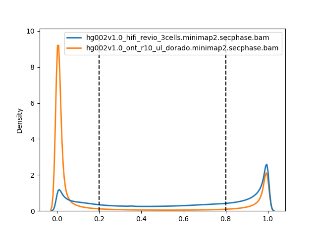

# HiFivONT_MLscores

This repo is made to document the determination of equivalent ML values between ONT and HiFi methylation calls using dorado v0.6.1 and primrose respectively. The primary purpose of this is to understand where the thresholding should be placed in terms of ML scores for uses that attempt to span the platforms(ex: fiberseq, modkit pileup).  

I used modkit and methylartist to understand how the two platforms are different in their scoring metrics.

### Modkit Summary:   

Using `--filter-percentile 0.5`
|  | ONT | HiFi | 
| --- | --- | --- |
| `C_pass_frac_modified_m` | 0.403 | 0.629 |

